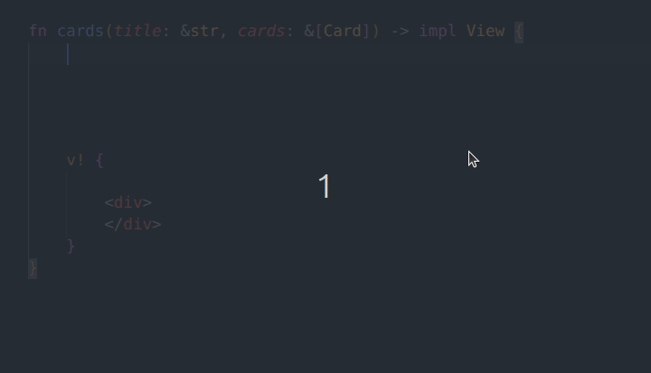

[](https://crates.io/crates/rshtml)
[](https://docs.rs/rshtml)
[](https://rshtml.github.io/)
---
# RsHtml

RsHtml is a compile-time, type-safe, lightweight, and flexible template engine for Rust. It aims to seamlessly integrate Rust code with HTML content. It allows developers to write dynamic templates that embed Rust expressions and makes it easier to generate HTML content programmatically. It generates efficient Rust code for template rendering at compile time.



#### Documentation and Editor Support

- See the [Documentation](https://rshtml.github.io/) for a full list of features and the [Editor Support](https://rshtml.github.io/#5-editor-support) section for editor integration details.

## v! macro
- Allows writing Rust blocks inside HTML (`<div>{ code() }</div>`) and embedding the resulting expressions into the template.
- Generates a type that implements the View trait and can render types that implement either the View or Display trait.
- HTML tags must be well-formed and properly closed.

```rust
    let user_info = v!(<p>name: {user.name}</p>);

    v! {
         <div class="user-info"> {user_info} </div>
    }
```

```rust
    fn cards(cards: &[Card]) -> impl View {
        let mut card_views = Vec::new();
        for card in cards {
            card_views.push(v!(<div class="card">{&card.title}</div>));
        }

        v! {
            <div>
                { card_views }
            </div>
        }
    }
```

```rust
    impl View for Home {
        fn render(&self, out: &mut dyn Write) -> Result {
            v!(<p>Home Page {&self.title}</p>).render(out)
        }
    }
```

## RsHtml derive macro
- Processes `.rs.html` templates from the default `views` directory.
- Embeds Rust expressions and blocks directly into HTML templates using the `@` prefix or HTML-like component syntax (e.g., `<Component/>`).
- Supports conditional rendering (`@if`, `@else`), loops (`@for`), and pattern matching (`@match`).
- Supports Rust code blocks (`@{}`), various Rust expression syntaxes (e.g., `@expression`, `@(expression)`, and a broad range of other Rust syntax.
- Provides helper functions (e.g., `@time()`).
- Supports raw output with `@raw` blocks and server-side comments with `@* ... *@`.

```razor
<h1>Welcome to RsHtml</h1>

@use "Component.rs.html" as Component

<Component title="home" is_ok=true>
    <p>child content</p>
</Component>

@if self.is_logged_in {
    <p>Hello, @self.username!</p>
} else {
    <p>Please log in to continue.</p>
}

<ul>
    @for item in self.items {
        <li>@item</li>
    }
</ul>

@{
    let x = 42;
    let y = x * 2;
    println!("Debug: x = {}, y = {}", x, y);
}

@* This is a comment and will not appear in the output *@
```

```rust
use rshtml::{RsHtml, traits::RsHtml};

#[derive(RsHtml)]
struct HomePage { // Looks for home.rs.html in views folder.
    title: String,
}

fn main() {
    let homepage = HomePage {
        title: "Home Page".to_string()
    };

    let result = homepage.render().unwrap();

    print!("{}", result);
}
```

## Installation

To use RsHtml in your Rust project, run `cargo add rshtml` command or add it as a dependency in your `Cargo.toml`:

```toml
[dependencies]
rshtml = "0.5.0"

# For RsHtml derive macro:
# The default folder can be changed. This is the default setup:
[package.metadata.rshtml]
views = { path = "views", extract_file_on_debug = false }
```

## Contributing

Contributions are welcome! Feel free to open issues or submit pull requests to improve RsHtml.
